# Wapn: UI Mockups

High-fidelity mockups generated with AI, paired with structural wireframe diagrams showing layout and content hierarchy.

Companion to the [full design document](2026-03-08-wapn-design.html).

---

## Key Screens

### 1. Onboarding

Four-step flow from first launch to the skill tree.

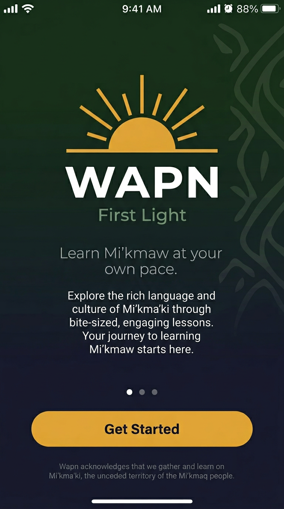

Wireframe diagram

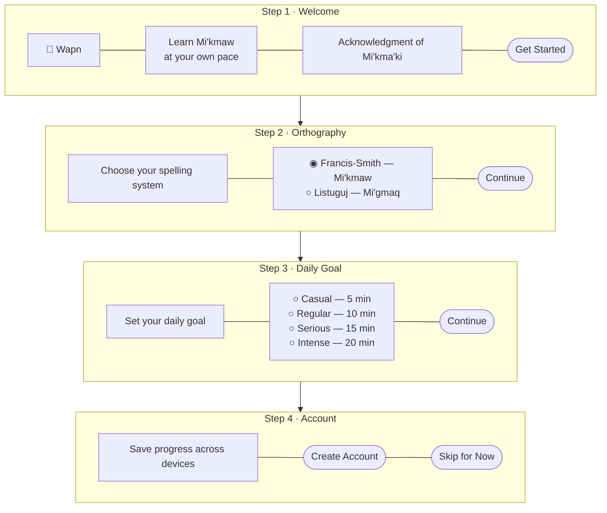
```mermaid
graph TD
    subgraph S1["Step 1 · Welcome"]
        W1["🌅 Wapn"]
        W2["Learn Mi'kmaw<br/>at your own pace"]
        W3["Acknowledgment of Mi'kma'ki"]
        W4(["Get Started"])
        W1 --- W2 --- W3 --- W4
    end
    subgraph S2["Step 2 · Orthography"]
        O1["Choose your spelling system"]
        O2["◉ Francis-Smith — Mi'kmaw<br/>○ Listuguj — Mi'gmaq"]
        O3(["Continue"])
        O1 --- O2 --- O3
    end
    subgraph S3["Step 3 · Daily Goal"]
        G1["Set your daily goal"]
        G2["○ Casual — 5 min<br/>○ Regular — 10 min<br/>○ Serious — 15 min<br/>○ Intense — 20 min"]
        G3(["Continue"])
        G1 --- G2 --- G3
    end
    subgraph S4["Step 4 · Account"]
        A1["Save progress across devices"]
        A2(["Create Account"])
        A3(["Skip for Now"])
        A1 --- A2 --- A3
    end
    S1 --> S2 --> S3 --> S4
```

---

### 2. Skill Tree (Home)

Main screen with vertical scrolling unit path. Solid arrows for unlocked units, dotted for locked.

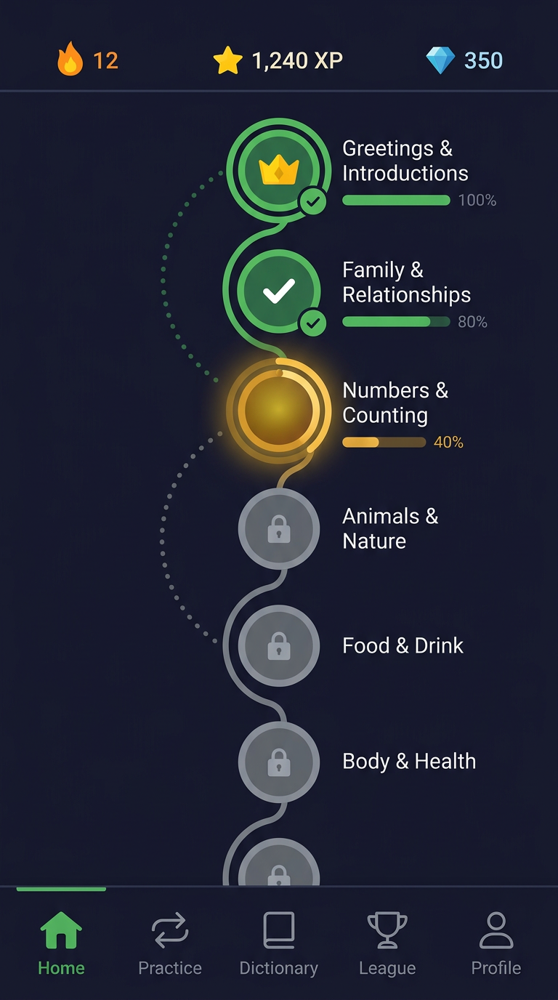

Wireframe diagram

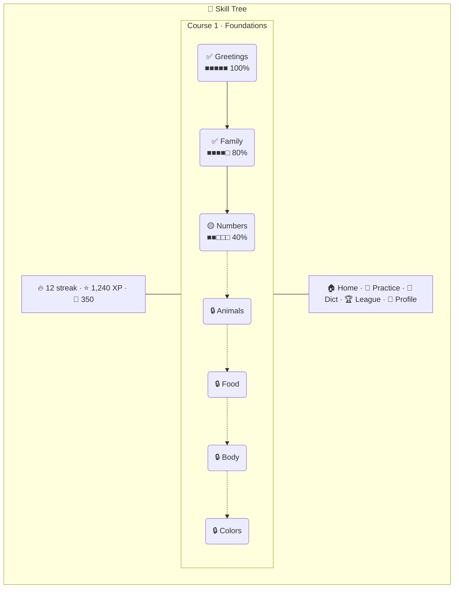
```mermaid
graph TD
    subgraph Home["📱 Skill Tree"]
        Stats["🔥 12 streak · ⭐ 1,240 XP · 💎 350"]

        subgraph Course["Course 1 · Foundations"]
            U1("✅ Greetings<br/>■■■■■ 100%")
            U2("✅ Family<br/>■■■■□ 80%")
            U3("🟡 Numbers<br/>■■□□□ 40%")
            U4("🔒 Animals")
            U5("🔒 Food")
            U6("🔒 Body")
            U7("🔒 Colors")
            U1 --> U2 --> U3 -.-> U4 -.-> U5 -.-> U6 -.-> U7
        end

        Nav["🏠 Home · 🔄 Practice · 📖 Dict · 🏆 League · 👤 Profile"]
        Stats --- Course --- Nav
    end
```

---

### 3. Exercise Screen (Generic Frame)

Common layout wrapping all exercise types. Content area varies per type (see Exercise Types below).

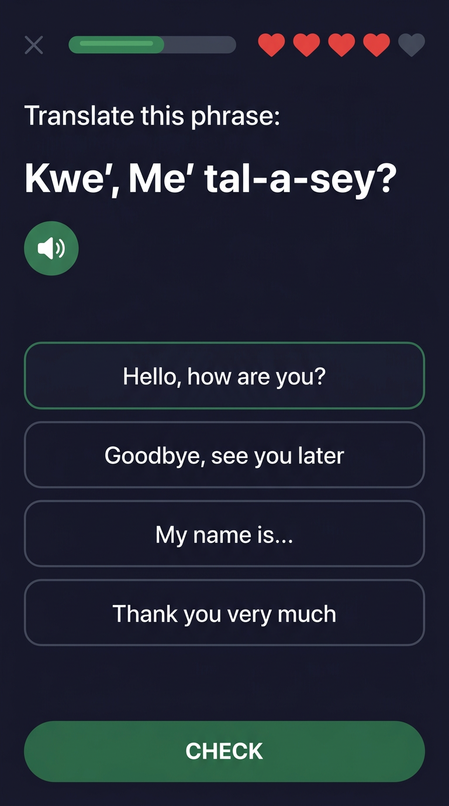

Wireframe diagram

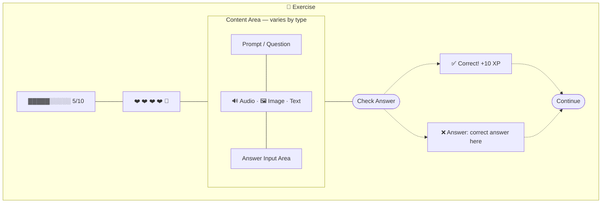
```mermaid
graph TD
    subgraph Frame["📱 Exercise"]
        Prog["▓▓▓▓▓░░░░░ 5/10"]
        Hearts["❤️ ❤️ ❤️ ❤️ 🤍"]

        subgraph Content["Content Area — varies by type"]
            Prompt["Prompt / Question"]
            Media["🔊 Audio · 🖼️ Image · Text"]
            Answer["Answer Input Area"]
            Prompt --- Media --- Answer
        end

        Check(["Check Answer"])

        Correct["✅ Correct! +10 XP"]
        Incorrect["❌ Answer: correct answer here"]
        Next(["Continue"])

        Prog --- Hearts --- Content --- Check
        Check -.-> Correct -.-> Next
        Check -.-> Incorrect -.-> Next
    end
```

---

### 4. Dictionary

Searchable word bank with detailed word cards.

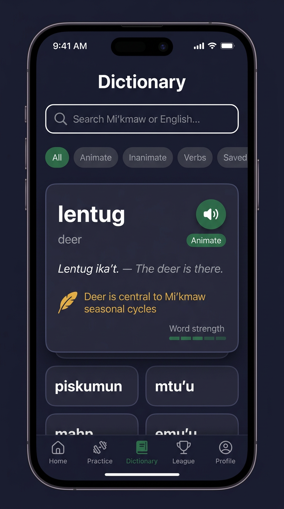

Wireframe diagram

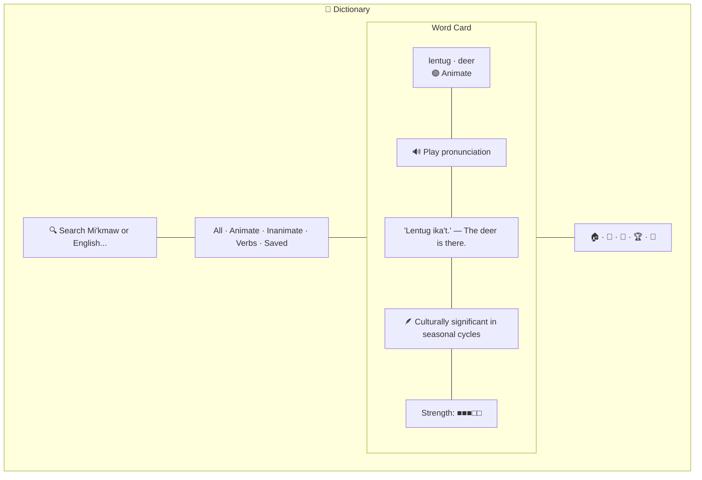
```mermaid
graph TD
    subgraph Dict["📱 Dictionary"]
        Search["🔍 Search Mi'kmaw or English..."]
        Filters["All · Animate · Inanimate · Verbs · Saved"]

        subgraph Card["Word Card"]
            WordInfo["lentug · deer<br/>🟢 Animate"]
            Audio["🔊 Play pronunciation"]
            Example["'Lentug ika't.' — The deer is there."]
            Note["🪶 Culturally significant in seasonal cycles"]
            Strength["Strength: ■■■□□"]
            WordInfo --- Audio --- Example --- Note --- Strength
        end

        Nav["🏠 · 🔄 · 📖 · 🏆 · 👤"]
        Search --- Filters --- Card --- Nav
    end
```

---

### 5. Profile & Stats

Gamification dashboard with streak, progress, and achievements.

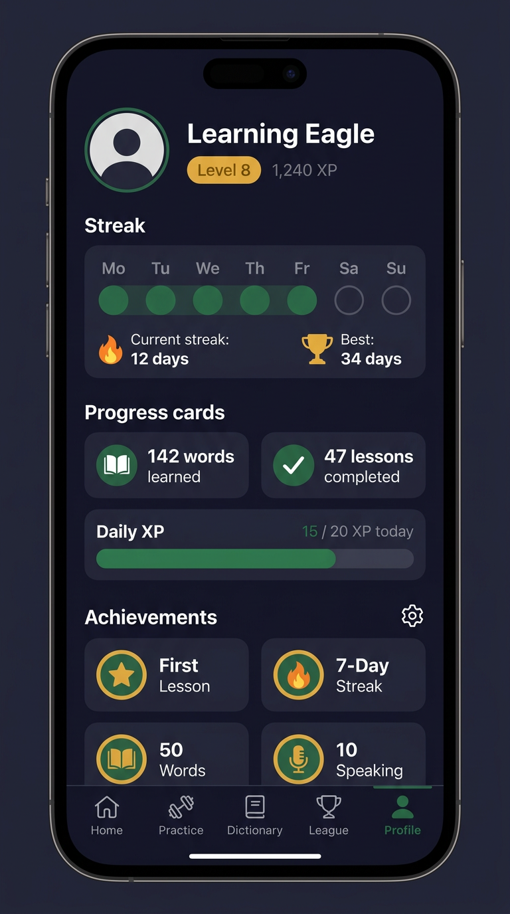

Wireframe diagram

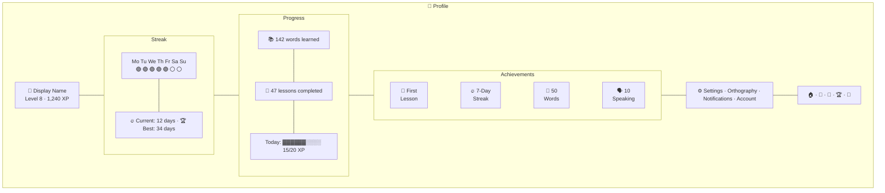
```mermaid
graph TD
    subgraph Profile["📱 Profile"]
        Avatar["👤 Display Name<br/>Level 8 · 1,240 XP"]

        subgraph Streak["Streak"]
            Cal["Mo Tu We Th Fr Sa Su<br/>🟢 🟢 🟢 🟢 🟢 ⚪ ⚪"]
            StreakInfo["🔥 Current: 12 days · 🏆 Best: 34 days"]
            Cal --- StreakInfo
        end

        subgraph Progress["Progress"]
            Words["📚 142 words learned"]
            Lessons["📝 47 lessons completed"]
            Daily["Today: ▓▓▓▓▓▓░░░░ 15/20 XP"]
            Words --- Lessons --- Daily
        end

        subgraph Badges["Achievements"]
            direction LR
            B1["🌟 First<br/>Lesson"] ~~~ B2["🔥 7-Day<br/>Streak"] ~~~ B3["📖 50<br/>Words"] ~~~ B4["🗣️ 10<br/>Speaking"]
        end

        Settings["⚙️ Settings · Orthography · Notifications · Account"]
        Nav["🏠 · 🔄 · 📖 · 🏆 · 👤"]
        Avatar --- Streak --- Progress --- Badges --- Settings --- Nav
    end
```

---

## Exercise Types

Each exercise uses the generic frame (Section 3). Diagrams below show the full screen including progress and controls.

| Diagram | Covers |
|---------|--------|
| **Selection** | Translation (L2→L1) · Listening · Image Selection |
| **Production** | Translation (L1→L2) · Fill in the Blank |
| **Speaking** | Record & compare pronunciation |
| **Matching** | Match word pairs |
| **Sorting** | Animacy Sort · Verb Class ID |
| **Word Building** | Morpheme assembly |
| **Cultural Context** | Cultural note + comprehension |

---

### 6. Selection Exercises

**Covers:** Translation (Mi'kmaw → English) · Listening · Image Selection

Prompt with optional audio, 3–4 tappable choice cards. Variants differ in prompt type.

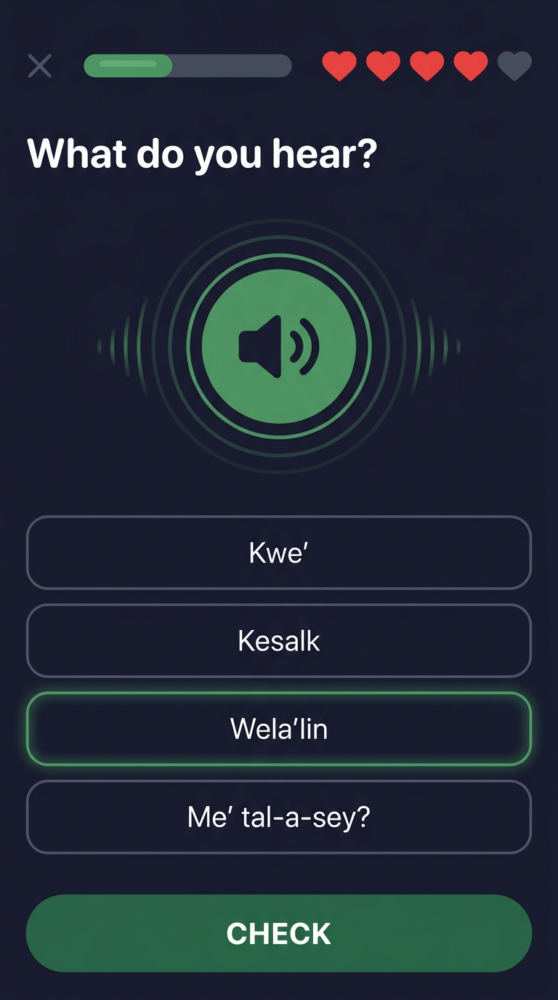

Wireframe diagram

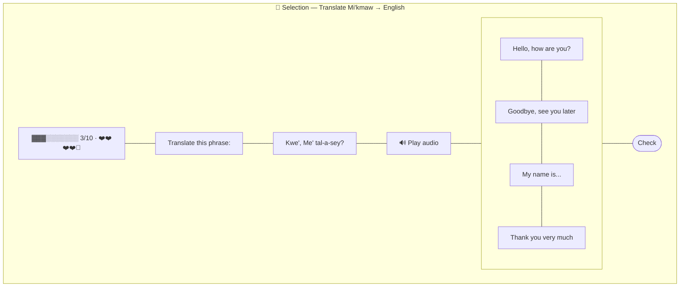
```mermaid
graph TD
    subgraph Sel["📱 Selection — Translate Mi'kmaw → English"]
        Prog["▓▓▓░░░░░░░ 3/10 · ❤️❤️❤️❤️🤍"]
        Prompt["Translate this phrase:"]
        Target["Kwe', Me' tal-a-sey?"]
        Audio["🔊 Play audio"]

        subgraph Choices[" "]
            C1["Hello, how are you?"]
            C2["Goodbye, see you later"]
            C3["My name is..."]
            C4["Thank you very much"]
            C1 --- C2 --- C3 --- C4
        end

        Check(["Check"])
        Prog --- Prompt --- Target --- Audio --- Choices --- Check
    end
```

> **Listening variant:** Prompt is audio-only — no Mi'kmaw text shown. User selects what they heard.
>
> **Image Selection variant:** Choices are images instead of text. User sees a Mi'kmaw word and picks the matching image.

---

### 7. Production Exercises

**Covers:** Translation (English → Mi'kmaw) · Fill in the Blank

User taps word tiles from a shuffled bank to assemble an answer.

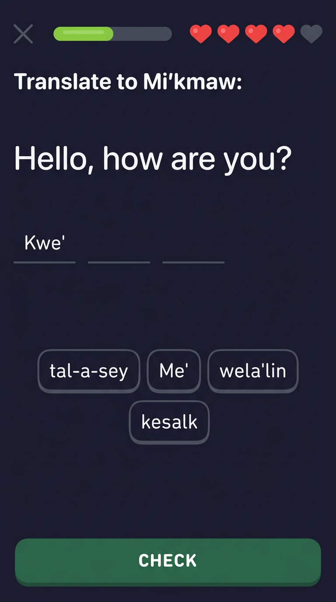

Wireframe diagram

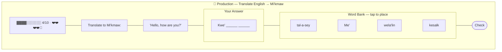
```mermaid
graph TD
    subgraph Prod["📱 Production — Translate English → Mi'kmaw"]
        Prog["▓▓▓▓░░░░░░ 4/10 · ❤️❤️❤️❤️🤍"]
        Prompt["Translate to Mi'kmaw:"]
        English["'Hello, how are you?'"]

        subgraph Answer["Your Answer"]
            Ans["Kwe' ______ ______"]
        end

        subgraph Bank["Word Bank — tap to place"]
            direction LR
            W1["tal-a-sey"] ~~~ W2["Me'"] ~~~ W3["wela'lin"] ~~~ W4["kesalk"]
        end

        Check(["Check"])
        Prog --- Prompt --- English --- Answer --- Bank --- Check
    end
```

> **Fill in the Blank variant:** A Mi'kmaw sentence with a gap. Word bank offers morphemes or words to complete it.

---

### 8. Speaking Exercise

Record pronunciation, compare waveforms with native speaker. Self-assessment — no automated scoring.

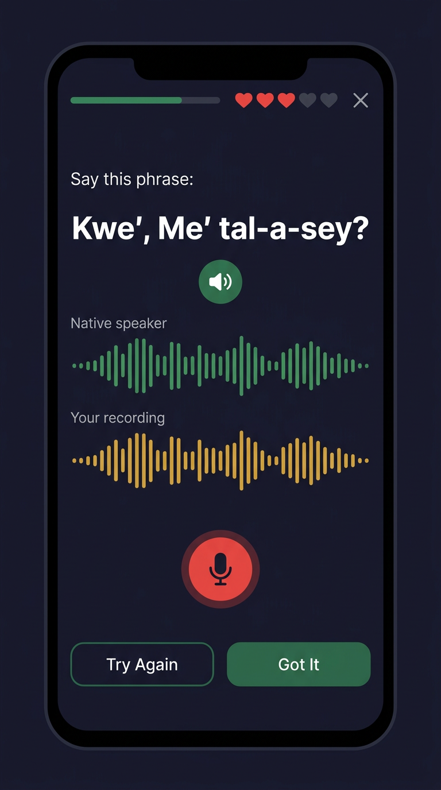

Wireframe diagram

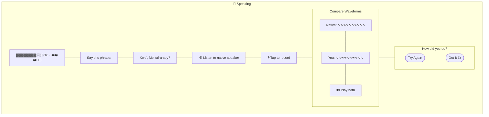
```mermaid
graph TD
    subgraph Speak["📱 Speaking"]
        Prog["▓▓▓▓▓▓▓▓░░ 8/10 · ❤️❤️❤️🤍🤍"]
        Prompt["Say this phrase:"]
        Target["Kwe', Me' tal-a-sey?"]
        Listen["🔊 Listen to native speaker"]
        Record["🎙️ Tap to record"]

        subgraph Compare["Compare Waveforms"]
            Native["Native: ∿∿∿∿∿∿∿∿∿∿"]
            Yours["You:      ∿∿∿∿∿∿∿∿∿∿"]
            Play["🔊 Play both"]
            Native --- Yours --- Play
        end

        subgraph Eval["How did you do?"]
            direction LR
            Again(["Try Again"]) ~~~ Good(["Got It 👍"])
        end

        Prog --- Prompt --- Target --- Listen --- Record --- Compare --- Eval
    end
```

---

### 9. Matching Exercise

Tap a word on the left, then its match on the right. Matched pairs highlight and lock.

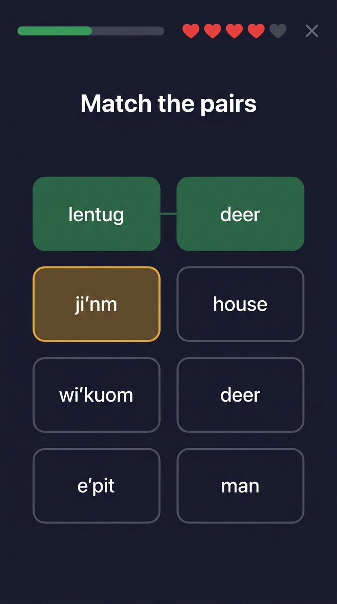

Wireframe diagram

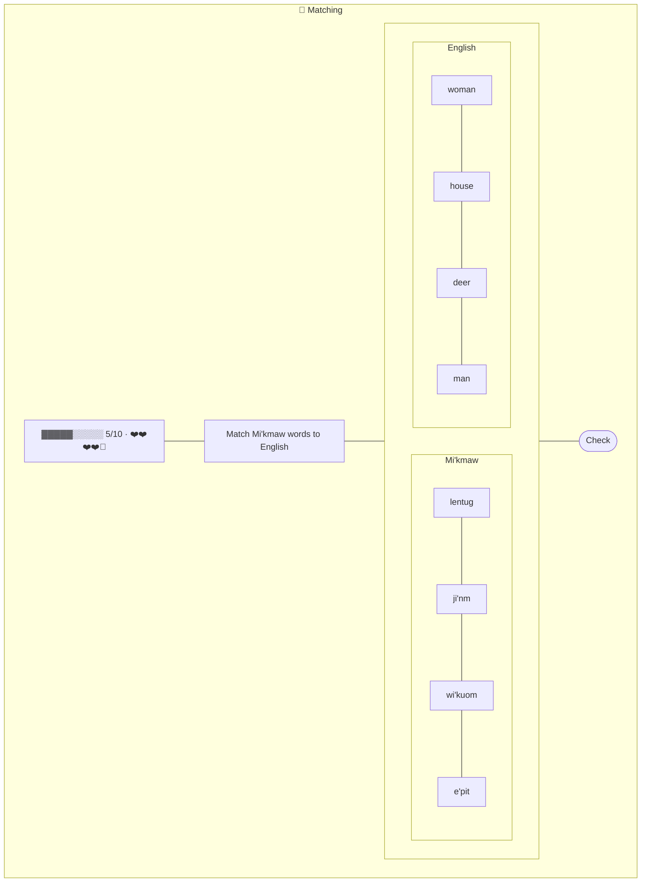
```mermaid
graph TD
    subgraph Match["📱 Matching"]
        Prog["▓▓▓▓▓░░░░░ 5/10 · ❤️❤️❤️❤️🤍"]
        Prompt["Match Mi'kmaw words to English"]

        subgraph Grid[" "]
            direction LR
            subgraph MK["Mi'kmaw"]
                L1["lentug"]
                L2["ji'nm"]
                L3["wi'kuom"]
                L4["e'pit"]
                L1 --- L2 --- L3 --- L4
            end
            subgraph EN["English"]
                R1["woman"]
                R2["house"]
                R3["deer"]
                R4["man"]
                R1 --- R2 --- R3 --- R4
            end
        end

        Check(["Check"])
        Prog --- Prompt --- Grid --- Check
    end
```

---

### 10. Sorting Exercises

**Covers:** Animacy Sort · Verb Class ID

Tap items from the pool into category zones.

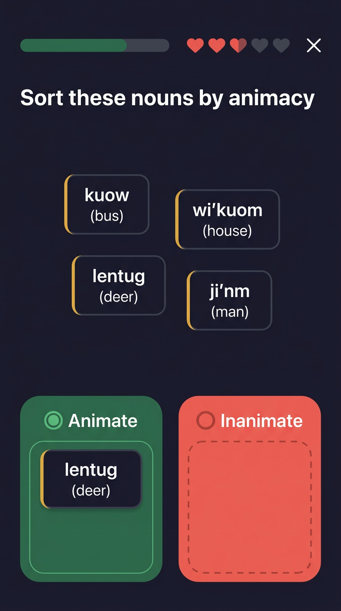

Wireframe diagram

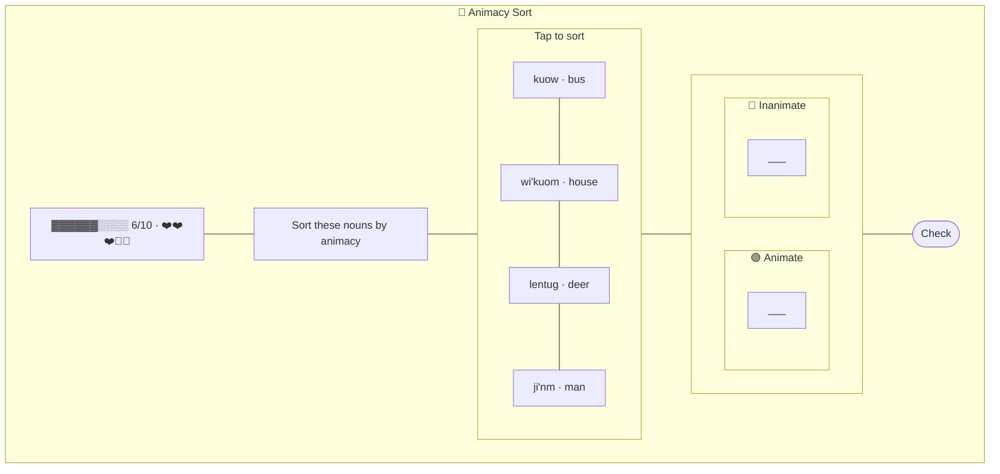
```mermaid
graph TD
    subgraph Sort["📱 Animacy Sort"]
        Prog["▓▓▓▓▓▓░░░░ 6/10 · ❤️❤️❤️🤍🤍"]
        Prompt["Sort these nouns by animacy"]

        subgraph Pool["Tap to sort"]
            P1["kuow · bus"]
            P2["wi'kuom · house"]
            P3["lentug · deer"]
            P4["ji'nm · man"]
            P1 --- P2 --- P3 --- P4
        end

        subgraph Zones[" "]
            direction LR
            subgraph Anim["🟢 Animate"]
                ASlot["___"]
            end
            subgraph Inanim["🔴 Inanimate"]
                ISlot["___"]
            end
        end

        Check(["Check"])
        Prog --- Prompt --- Pool --- Zones --- Check
    end
```

> **Verb Class ID variant:** Four category zones instead of two — VAI (animate intransitive), VII (inanimate intransitive), VTA (transitive animate), VTI (transitive inanimate). Users categorize verbs from context sentences.

---

### 11. Word Building Exercise

Drag or tap morpheme tiles to assemble a polysynthetic word. Teaches Mi'kmaw word structure.

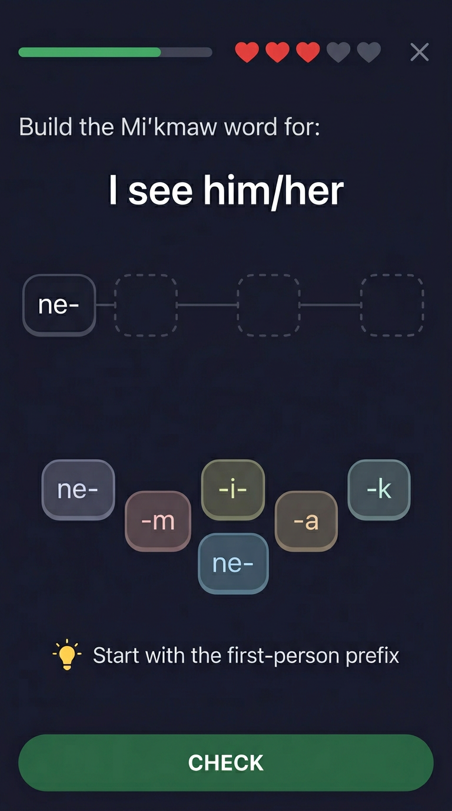

Wireframe diagram

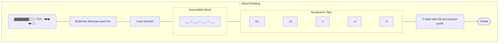
```mermaid
graph TD
    subgraph Build["📱 Word Building"]
        Prog["▓▓▓▓▓▓▓░░░ 7/10 · ❤️❤️❤️🤍🤍"]
        Prompt["Build the Mi'kmaw word for:"]
        English["'I see him/her'"]

        subgraph Target["Assembled Word"]
            Slot["___ + ___ + ___ + ___"]
        end

        subgraph Tiles["Morpheme Tiles"]
            direction LR
            M1["ne-"] ~~~ M2["-m"] ~~~ M3["-i-"] ~~~ M4["-a"] ~~~ M5["-k"]
        end

        Hint["💡 Start with the first-person prefix"]
        Check(["Check"])
        Prog --- Prompt --- English --- Target --- Tiles --- Hint --- Check
    end
```

---

### 12. Cultural Context Exercise

Cultural note card followed by a comprehension question. Integrates culture with language learning.

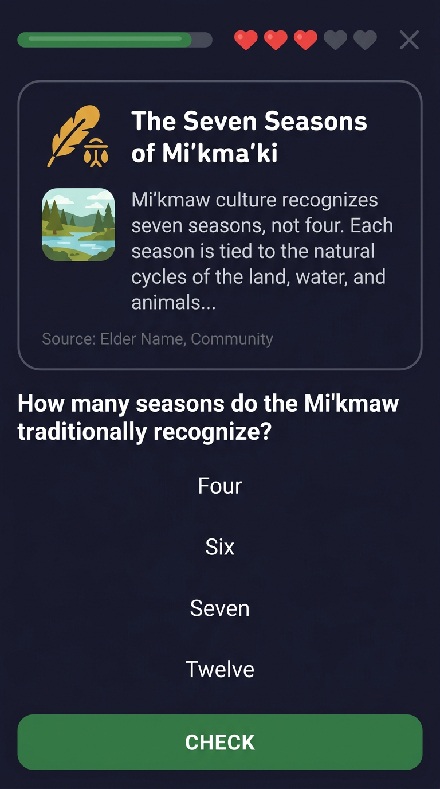

Wireframe diagram

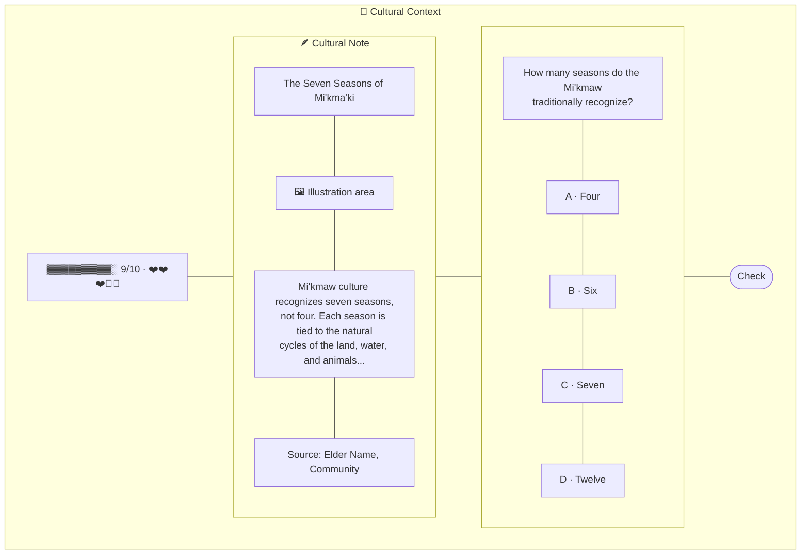
```mermaid
graph TD
    subgraph Culture["📱 Cultural Context"]
        Prog["▓▓▓▓▓▓▓▓▓░ 9/10 · ❤️❤️❤️🤍🤍"]

        subgraph Card["🪶 Cultural Note"]
            Title["The Seven Seasons of Mi'kma'ki"]
            Illust["🖼️ Illustration area"]
            Body["Mi'kmaw culture recognizes seven seasons,<br/>not four. Each season is tied to the natural<br/>cycles of the land, water, and animals..."]
            Credit["Source: Elder Name, Community"]
            Title --- Illust --- Body --- Credit
        end

        subgraph Question[" "]
            Q["How many seasons do the Mi'kmaw<br/>traditionally recognize?"]
            C1["A · Four"]
            C2["B · Six"]
            C3["C · Seven"]
            C4["D · Twelve"]
            Q --- C1 --- C2 --- C3 --- C4
        end

        Check(["Check"])
        Prog --- Card --- Question --- Check
    end
```

---

---

*High-fidelity mockups generated with Gemini 3.1 Flash (Nano Banana 2) via fal.ai. Wireframe diagrams use Mermaid. Final visual design will be refined during implementation.*
